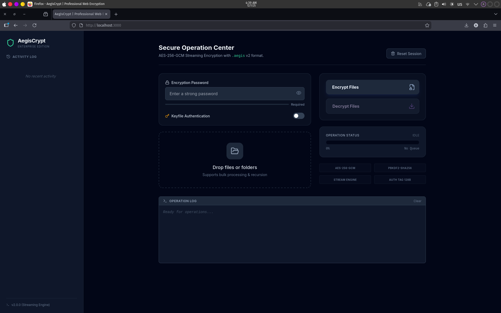

# 🛡️ AegisCrypt Web

**Professional Client-Side Encryption Suite**

AegisCrypt Web is a modern, high-performance encryption tool built with **React** and the **Web Crypto API**. It brings desktop-grade security (AES-256-GCM) to the browser, allowing users to encrypt and decrypt files and folders locally without data ever leaving their device.


---
## Demo

https://aegis-crypt-web.vercel.app/

---

## Features

- **Zero-Knowledge Architecture**: All encryption happens in your browser's memory. No files are ever uploaded to a server.
- **Industry Standard Security**:
  - **Algorithm**: AES-256-GCM (Galois/Counter Mode).
  - **Key Derivation**: PBKDF2 with HMAC-SHA256 (100,000 iterations).
  - **Salt**: 16-byte cryptographically strong random salt.
  - **IV/Nonce**: 12-byte random initialization vector per file.
- **Official .aegis Format**: Includes magic header and versioning for file integrity.
- **Modern UI/UX**:
  - Drag & Drop support.
  - Recursive folder processing.
  - Real-time operation logging.
  - Dark mode interface designed with Tailwind CSS.
---

## Technical Specifications

AegisCrypt uses the browser's native `window.crypto.subtle` API for maximum performance and security.

### The `.aegis` File Format (v1)

AegisCrypt uses a custom binary format designed for integrity and future-proofing.

| Offset | Size | Name | Description |
|:---:|:---:|:---|:---|
| 0 | 5 Bytes | **Magic** | Signature `AEGIS` (Hex: `41 45 47 49 53`) |
| 5 | 1 Byte | **Version** | Format version (Current: `0x01`) |
| 6 | 16 Bytes | **Salt** | Random bytes used for PBKDF2 key derivation |
| 22 | 12 Bytes | **IV** | Initialization Vector for AES-GCM |
| 34 | N Bytes | **Data** | Ciphertext + Auth Tag (16 bytes) |

**Total Header Size**: 34 Bytes

---

## Installation & Usage

### Prerequisites
- Node.js (v18 or higher)
- npm or yarn

### 1. Clone and Install
```bash
git clone https://github.com/Bangkah/AegisCrypt-Web.git
cd AegisCrypt-Web
npm install
```

### 2. Run Locally
```bash
npm start
# App will run at http://localhost:3000
```

### 3. Build for Production
```bash
npm run build
```

---

## Project Structure

```
src/
├── components/
│   ├── LogBox.tsx        # Terminal-style operation logger
│   └── PasswordInput.tsx # Secure input with strength meter
├── services/
│   └── cryptoService.ts  # Core Web Crypto API implementation
├── constants.ts          # Crypto constants (Iterations, Salt sizes)
├── types.ts              # TypeScript interfaces
├── App.tsx               # Main application controller
└── index.tsx             # Entry point
```

---

## Security Notice

While this application uses industry-standard algorithms:
1.  **Forgot Password**: If you lose your password, **your data is lost forever**. There is no "reset" or "backdoor."
2.  **Browser Limitations**: Since this runs in the browser, extremely large files (e.g., >2GB) may hit browser memory limits depending on your hardware.

