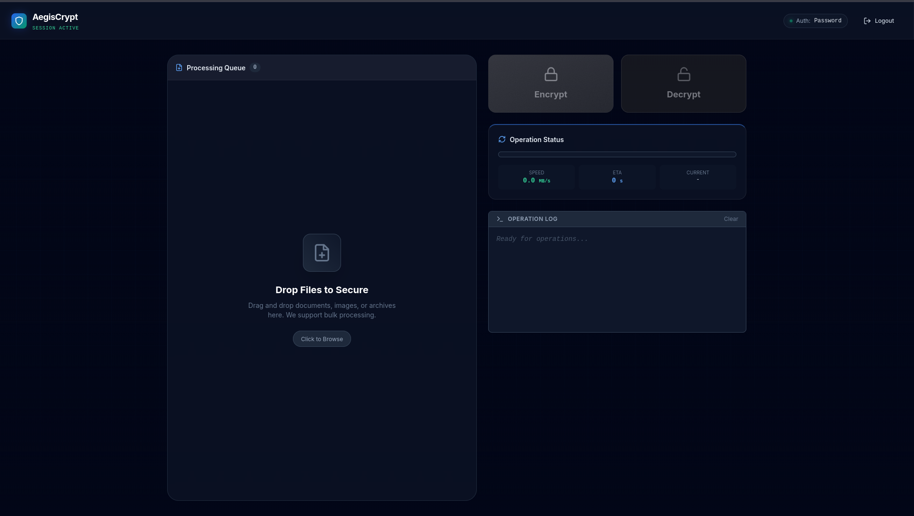
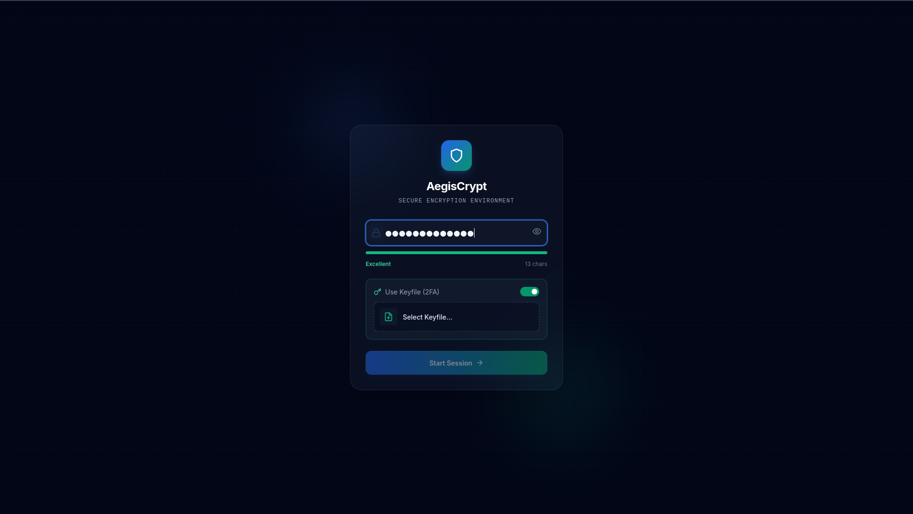

# 🛡️ AegisCrypt Web


**Professional Client-Side Encryption Suite**

[](https://en.wikipedia.org/wiki/Galois/Counter_Mode)
[](https://en.wikipedia.org/wiki/PBKDF2)
[](https://vitest.dev/)
[](LICENSE)

AegisCrypt Web is a military-grade, browser-based encryption tool. It is designed to be **Zero-Knowledge**, meaning your files and passwords are processed entirely in your browser's RAM via Web Assembly / Web Crypto API and never transmitted to any server.

---

## ✨ Features at a Glance

*   **🔒 AES-256-GCM**: Authenticated encryption that detects tampering.
*   **🔑 Two-Factor Authentication**: Combine `Password` + `Keyfile` (e.g., a photo, a document) for ultimate security.
*   **🌊 Streaming Engine (v2)**: Encrypts multi-gigabyte files without crashing the browser (low RAM footprint).
*   **🎨 Cyberpunk Glass UI**: A fully responsive, modern interface with real-time animations.
*   **⚡ Real-time Telemetry**: View encryption speed (MB/s) and ETA.
*   **📁 Batch Processing**: Drag & drop entire folders to process queue.

---

## 📸 Screenshots & Demo

### 1. The Dashboard
The main command center. Monitor your queue, check speeds, and manage sessions.



### 2. Login & Session (2FA)
Secure entry point. Requires password and optional keyfile to derive the master encryption key.



### 3. Processing Queue
Manage your files before committing to encryption.


---

## 🔒 Security Architecture

AegisCrypt follows strict cryptographic standards to ensure data integrity and confidentiality.

### 1. Core Algorithm
*   **Cipher:** AES-256-GCM (Galois/Counter Mode).
*   **Why GCM?**: Unlike CBC, GCM provides **Authenticated Encryption**. It ensures that if a file is tampered with (even a single bit changed), decryption will fail immediately instead of producing garbage data.

### 2. Key Derivation (PBKDF2)
*   **Function:** `PBKDF2` with `HMAC-SHA-256`.
*   **Iterations:** 100,000 (exceeds NIST recommendations for password hashing).
*   **Salt:** 32-byte Cryptographically Secure Random Salt generated per file.
*   **Purpose:** Protects against Brute-Force and Rainbow Table attacks.

### 3. Keyfile Logic (2FA)
*   **Logic:** `KeyMaterial = Password_Bytes + SHA256(Keyfile_Bytes)`
*   This ensures that even if an attacker guesses your password, they cannot decrypt the file without the exact physical file used as the key.

### 4. Streaming Encryption (v2)
*   Files are broken into **1MB Chunks**.
*   Each chunk has a **Unique IV (Initialization Vector)**.
*   This prevents pattern analysis on large files and protects against IV reuse attacks.

---

## 🚀 Getting Started

### Prerequisites
*   Node.js (v18+)
*   npm or yarn

### Installation
```bash
# 1. Clone the repository
git clone https://github.com/Bangkah/AegisCrypt-Web.git

# 2. Enter directory
cd AegisCrypt-Web

# 3. Install Dependencies
npm install

# 4. Start Development Server
npm start
```

The app will launch at `http://localhost:5173` (Vite default).

---

## 📖 User Guide

### Encryption Workflow
1.  **Login**: Enter a strong password. (Optional) Drag a random file (image, song, doc) into the Keyfile area.
2.  **Add Files**: Drag files or folders into the glass drop zone.
3.  **Encrypt**: Click the **Blue Lock Button**.
4.  **Wait**: Watch the progress bar. Large files are streamed efficiently.
5.  **Download**: The browser will auto-download `.aegis` files.

### Decryption Workflow
1.  **Login**: **MUST** use the exact same password (and Keyfile if used) as encryption.
2.  **Add Files**: Drag `.aegis` files into the zone.
3.  **Decrypt**: Click the **Dark Unlock Button**.
4.  **Result**: Original files are restored.

---

## 📂 Project Structure

```
aegiscrypt-web/
├── src/
│   ├── components/
│   │   ├── FileList.tsx       # Queue UI
│   │   ├── LogBox.tsx         # Operation Logs
│   │   ├── LoginScreen.tsx    # Auth Entry
│   │   └── PasswordInput.tsx  # Strength Meter
│   ├── services/
│   │   └── cryptoService.ts   # 🛡️ Core Crypto Engine (AES-GCM)
│   ├── App.tsx                # Main Controller
│   ├── constants.ts           # Config & Magic Bytes
│   └── types.ts               # TypeScript Interfaces
├── tests/
│   ├── cryptoService.test.ts  # Vitest Security Suite
│   └── setup.ts               # Polyfills
├── index.html                 # Entry HTML & Styles
└── vite.config.ts             # Build Config
```

---

## 📄 File Format Spec (.aegis v2)

Binary layout for interoperability with the Desktop version:

| Byte Offset | Length | Content | Value |
|---|---|---|---|
| 0 | 5 | Magic | `AEGIS` |
| 5 | 1 | Version | `0x02` |
| 6 | 32 | Salt | Random Bytes |
| 38 | 4 | Chunk 1 Len | Int32 LE |
| 42 | 12 | Chunk 1 IV | Random Bytes |
| 54 | N | Ciphertext | Encrypted Data |
| ... | ... | ... | Repeat for Chunk 2... |

---

## ⚠️ FAQ & Troubleshooting

**Q: I lost my password/keyfile. Can you recover my data?**
> **No.** AegisCrypt is zero-knowledge. There are no backdoors. If credentials are lost, the data is mathematically unrecoverable.

**Q: Why does the browser ask for permission to download multiple files?**
> When processing a batch, the app triggers a download for each file. Browsers often block automatic multiple downloads. Please click "Allow" when prompted.

**Q: What is the maximum file size?**
> Tested up to **10GB** on Chrome 120+. The limitation is the browser's Blob implementation. For 100GB+ files, use the AegisCrypt Desktop (C#) version.

---
